# DataLens Architecture

This document describes the current architecture of DataLens as implemented in the repository.

DataLens is a **local-first analytics and AI engineering platform** built as a monorepo with a Python/FastAPI backend and a Next.js frontend. The architecture deliberately separates deterministic computation, AI interpretation, model training, evaluation, observability, persistence, and governance.

The system is designed around one core principle:

> Generated intelligence may assist decisions, but trusted state, analytical computation, evaluation evidence, and lifecycle authority remain server-owned and explicitly validated.

---

## 1. System context

At the highest level, DataLens connects four product concerns:

1. **Data Analyst workflow**
   Import, review, clean, transform, combine, validate, analyze, visualize, and report.

2. **AI-assisted semantics**
   Understand analytical intent, review semantics, retrieve contextual evidence, and generate grounded explanations.

3. **ML / Deep Learning engineering**
   Train, compare, evaluate, persist, load, predict, monitor, and govern model artifacts.

4. **AI Engineering operations**
   Evaluation gates, protected benchmarks, model lifecycle governance, observability, privacy controls, Docker delivery, and CI/CD.

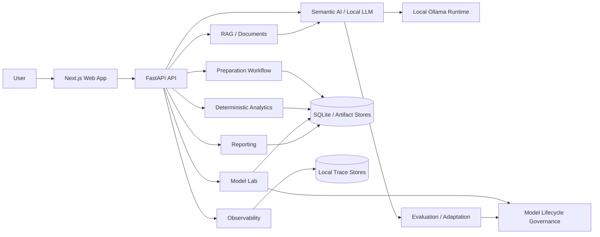

---

## 2. Monorepo structure

```text
datalens/
|
|-- apps/
|   |-- api/
|   |   |-- app/
|   |   |   |-- adaptation/
|   |   |   |-- ai/
|   |   |   |-- analysis/
|   |   |   |-- api/
|   |   |   |-- cleaning/
|   |   |   |-- core/
|   |   |   |-- dashboard/
|   |   |   |-- deep_learning/
|   |   |   |-- discovery/
|   |   |   |-- evals/
|   |   |   |-- evaluation/
|   |   |   |-- evidence/
|   |   |   |-- execution/
|   |   |   |-- ingestion/
|   |   |   |-- ml/
|   |   |   |-- model_lifecycle/
|   |   |   |-- models/
|   |   |   |-- observability/
|   |   |   |-- persistence/
|   |   |   |-- planning/
|   |   |   |-- preparation/
|   |   |   |-- profiling/
|   |   |   |-- ranking/
|   |   |   |-- relationships/
|   |   |   |-- reporting/
|   |   |   |-- security/
|   |   |   |-- semantics/
|   |   |   |-- statistics/
|   |   |   `-- visualization/
|   |   |
|   |   |-- artifacts/
|   |   |-- benchmarks/
|   |   |-- evals/
|   |   |-- tests/
|   |   |-- var/
|   |   |-- Dockerfile
|   |   `-- requirements.txt
|   |
|   `-- web/
|       |-- src/
|       |   |-- app/
|       |   `-- components/
|       |-- public/
|       |-- Dockerfile
|       `-- package.json
|
|-- .github/
|   `-- workflows/
|       |-- datalens-evals.yml
|       |-- datalens-runtime.yml
|       |-- datalens-publish.yml
|       `-- datalens-release.yml
|
|-- compose.yaml
|-- compose.registry.yaml
`-- README.md
```

The backend is intentionally split by capability rather than organized as one large service module.

---

## 3. Runtime architecture

The standard runtime is local-first.

### Web runtime

The frontend runs as a Next.js application.

Current container runtime characteristics:

- Node 22 Alpine;
- production Next.js standalone output;
- non-root `datalens` user;
- port `3000`;
- healthcheck on the local frontend endpoint;
- configurable public API URL through `NEXT_PUBLIC_DATALENS_API_URL`.

### API runtime

The backend runs as a FastAPI application.

Current container runtime characteristics:

- Python 3.13 slim image;
- non-root `datalens` user;
- port `8000`;
- healthcheck on `/health`;
- persistent runtime state under `/app/var`;
- explicit filesystem locations for SQLite, preparation artifacts, reporting artifacts, and traces.

### Local LLM runtime

LLM-backed capabilities are designed around a local Ollama runtime.

In the Docker configuration, the API can connect to an Ollama process running on the host through:

```text
DATALENS_OLLAMA_HOST=http://host.docker.internal:11434
```

The Docker bridge is explicitly controlled through:

```text
DATALENS_LLM_DOCKER_BRIDGE_ENABLED
```

### Standard container topology

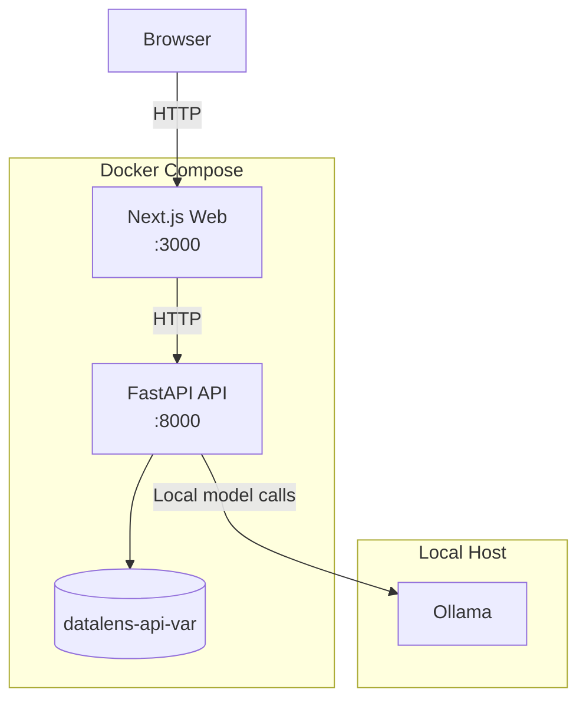

The default Compose bindings expose the web and API services on loopback interfaces rather than all network interfaces.

---

## 4. Backend application composition

`app.main` is the backend composition root.

The FastAPI application assembles routers for product capabilities including:

- analysis;
- requested-resolution workflows;
- document ingestion;
- preparation cleaning;
- preparation combination;
- preparation identity;
- preparation quality;
- preparation semantics;
- preparation sessions;
- preparation transformations;
- preparation validation;
- preparation workflows;
- report selection;
- model training;
- Model Lab;
- ML monitoring;
- ML performance monitoring;
- model health;
- monitoring alerts.

Runtime observability is installed as middleware around the API.

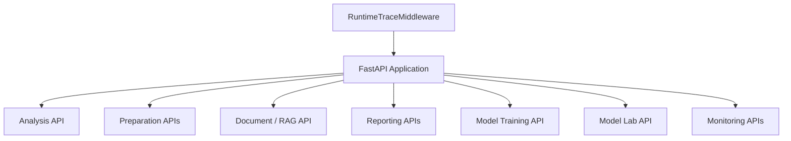

---

## 5. Preparation architecture

Preparation is modeled as a server-owned workflow rather than a single mutation endpoint.

The current preparation session model contains explicit stages:

```text
IMPORT
UNDERSTAND
QUALITY
CLEAN
TRANSFORM
COMBINE
VALIDATE
```

The backend distinguishes:

- the immutable root datasets selected for preparation;
- the final analytical output datasets;
- current preparation stage state;
- workflow revision;
- validated workflow snapshot.

### Server-owned state

Preparation session state is explicitly documented in code as server-owned.

The browser does not submit a complete authoritative preparation session object. Instead, the backend owns the current state and exposes a read-only view.

This prevents the client from manufacturing trusted readiness or workflow state.

### Revision control

Preparation decisions use revision-aware state.

A stale decision can be rejected when it was evaluated against an older session revision. This protects multi-step preparation from silently committing decisions against stale workflow state.

### Persistence

Preparation session state is persisted through SQLite-backed infrastructure.

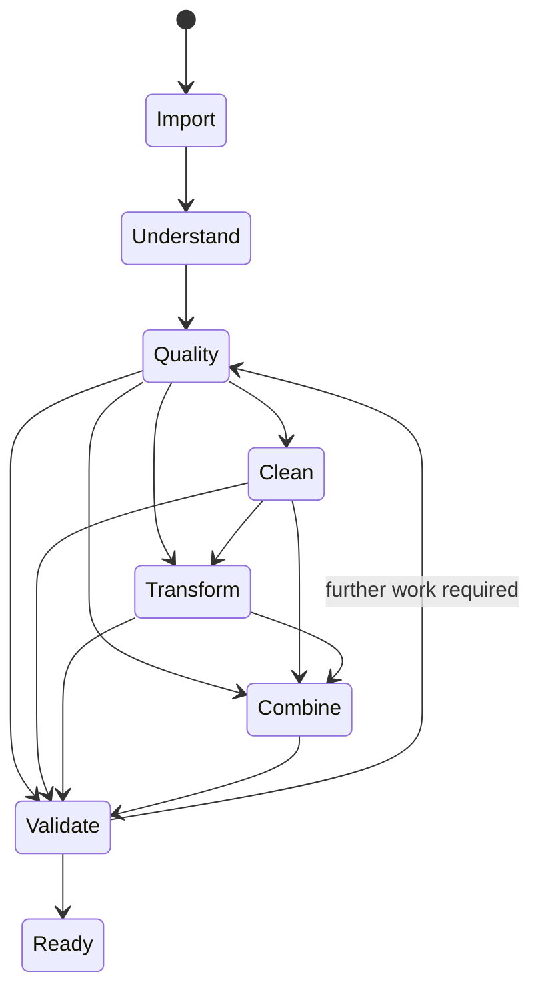

The exact transition logic remains backend-owned and contract-driven; the diagram represents the product-level preparation progression.

---

## 6. Analytical architecture

DataLens separates analytical interpretation from analytical computation.

The intended authority chain is:

```text
User request
    |
    v
Intent / planning
    |
    v
Validated analytical plan
    |
    v
Deterministic execution
    |
    v
Structured analytical result
    |
    v
Visualization / reporting / grounded explanation
```

### Deterministic execution boundary

Numerical and statistical results should be generated by deterministic execution paths whenever possible.

LLM reasoning is not treated as a substitute for:

- aggregations;
- statistical tests;
- correlations;
- rankings;
- time-series calculations;
- grouped metrics;
- deterministic transformations.

### Why this boundary matters

The separation provides:

- reproducibility;
- testability;
- auditable numerical outputs;
- lower hallucination risk;
- consistent reporting;
- clearer evaluation.

---

## 7. Planning and orchestration

The planning layer turns user intent into explicit analytical or preparation decisions.

The architecture contains dedicated modules for:

- planning;
- execution;
- requested-resolution;
- evidence;
- prioritization;
- tool-oriented orchestration.

A recurring design rule is that an LLM may propose or classify intent, while execution authority remains with validated server-side contracts.

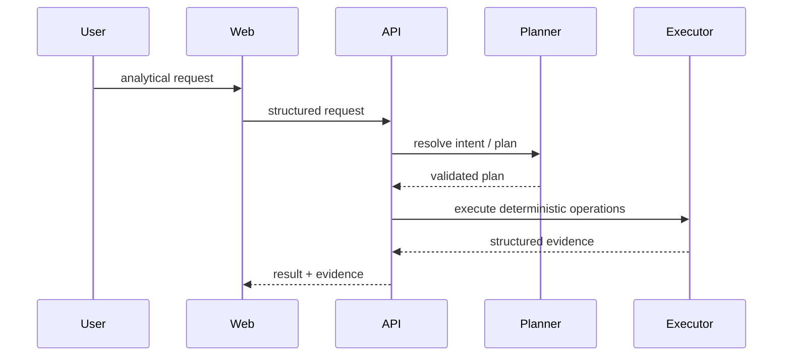

---

## 8. Document ingestion and RAG

Document ingestion is implemented independently from model generation.

Supported document formats include:

- PDF;
- DOCX;
- TXT;
- Markdown.

The ingestion layer:

1. validates supported file types;
2. extracts text;
3. normalizes text;
4. creates source-aware chunks;
5. records document metadata;
6. produces a structured ingestion report.

Current ingestion safeguards include limits on:

- document count;
- total document bytes;
- chunk size;
- chunk overlap.

### Retrieval architecture

The RAG-related backend is separated into dedicated concerns:

- `rag.py` — ingestion and document structures;
- `rag_retrieval.py` — retrieval;
- `rag_context.py` — context construction;
- `rag_relevance.py` — relevance decisions;
- `rag_explanation.py` — grounded explanation.

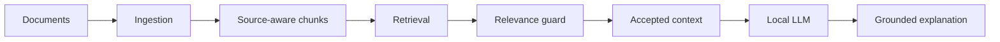

Retrieval is therefore not equivalent to acceptance.

A retrieved chunk still passes through downstream relevance and context rules before being used as trusted explanatory context.

---

## 9. Local LLM integration

DataLens uses local LLM execution for semantic and explanatory tasks.

The AI subsystem includes dedicated modules for:

- local Ollama runtime access;
- analytical reasoning;
- semantic understanding;
- structured AI outputs;
- tool orchestration;
- controlled request handling.

The architecture treats the LLM as one component inside a larger controlled system.

### Model boundary

The preferred model boundary is:

```text
Minimal necessary input
        |
        v
Controlled prompt / structured context
        |
        v
Local LLM
        |
        v
Structured / validated output
        |
        v
Deterministic or server-owned downstream logic
```

This reduces the number of decisions that depend on unstructured generated text.

---

## 10. AI egress and privacy architecture

The security layer includes explicit modules for:

- LLM egress;
- LLM payload construction;
- semantic value sampling.

The broader backend also contains privacy-aware behavior in:

- observability;
- API error translation;
- model loading;
- evaluation boundaries;
- preparation AI behavior;
- reporting.

The system is therefore designed around distributed security boundaries rather than one centralized security class.

### Main privacy goals

DataLens attempts to avoid exposing:

- raw dataset rows when not required;
- internal filesystem paths;
- internal exception messages;
- model artifacts across workflow boundaries;
- private model state;
- protected evaluation gold labels before scoring;
- uncontrolled document content in traces.

---

## 11. Observability architecture

Observability is split into runtime traces and AI traces.

Current observability modules include:

- `request_context.py`;
- `runtime_trace.py`;
- `ai_trace.py`;
- `trace_store.py`;
- `trace_explorer.py`.

### Runtime request tracing

Each runtime request can receive a generated correlation identifier:

```text
X-DataLens-Request-ID
```

Runtime trace records capture controlled metadata such as:

- request identifier;
- timestamp;
- HTTP method;
- server-owned route template;
- status code;
- duration;
- validated workflow identifier when available;
- high-level failure kind.

### Deliberately excluded trace data

The runtime privacy contract explicitly states that traces do not persist:

- request bodies;
- response bodies;
- query strings;
- incoming request headers;
- client IPs;
- raw dataset rows;
- uploaded file contents;
- document chunks;
- exception messages;
- filesystem paths.

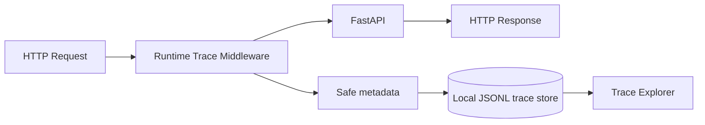

This is a core architectural rule: **observability must not become a secondary raw-data store**.

---

## 12. Model Lab architecture

Model Lab is the product surface for trained model artifacts.

Its API is exposed under:

```text
/model-lab
```

The service layer supports operations such as:

- list trusted models;
- retrieve model details;
- evaluate a trusted model;
- execute predictions.

### Trusted artifact boundary

Model Lab does not expose arbitrary paths or estimator objects to the client.

Frontend contracts intentionally omit low-level sensitive artifact details such as:

- model filesystem path;
- model bytes;
- raw estimator object;
- complete internal training contract.

### Cross-workflow isolation

A workflow mismatch is intentionally translated to the same public shape as a missing model.

This avoids revealing that a model identifier exists inside another preparation workflow.

### Evaluation boundary

Evaluation uses server-owned evidence.

The client does not provide authoritative holdout results or evaluation state.

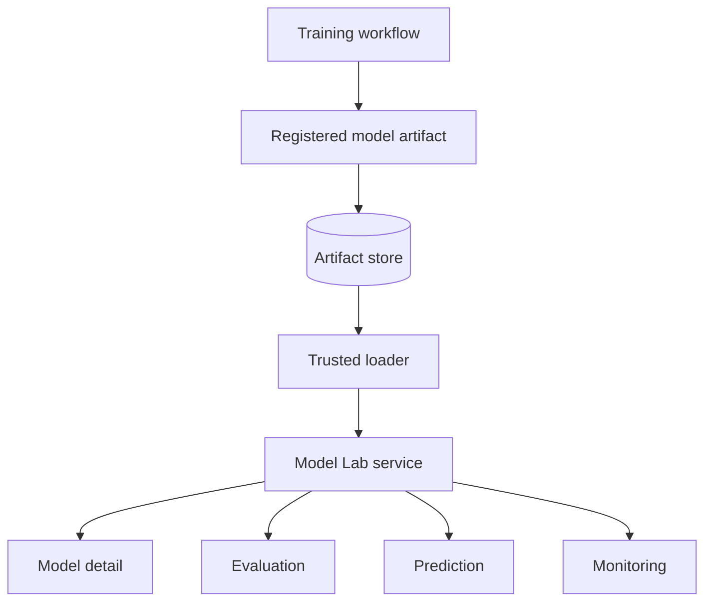

---

## 13. Classical ML architecture

The classical ML stack includes dedicated modules for:

- estimator contracts;
- preprocessing;
- training;
- experiment provenance;
- artifact persistence;
- evaluation;
- diagnostics;
- comparison;
- monitoring;
- drift;
- model health;
- alerting.

### Artifact registration

Classical ML executors register model artifacts through the shared ML artifact store.

This creates a stable boundary between:

- model creation;
- persisted artifact;
- trusted loading;
- later evaluation or prediction.

### Model selection evidence

Model comparison and tuning preserve selection evidence rather than only exposing a final model filename.

This helps distinguish:

- standalone models;
- comparison-selected models;
- tuned-model promotion decisions.

---

## 14. Deep Learning architecture

Deep learning is implemented as a dedicated backend domain.

Current deep-learning capabilities include:

### Tabular neural workflows

- neural datasets;
- tensor preparation;
- networks;
- training;
- evaluation;
- runtime execution;
- model bundles;
- trusted model loading.

### Autoencoder anomaly detection

Dedicated components include:

- autoencoder dataset preparation;
- autoencoder network;
- training;
- evaluation;
- threshold selection;
- bundle creation;
- trusted loading;
- Model Lab execution.

### Neural time-series workflows

Current implementations include:

- MLP time-series execution;
- RNN network and execution;
- LSTM network and execution;
- scaling;
- worker execution;
- bundle construction;
- bundle inference;
- model comparison;
- artifact registration.

### Shared lifecycle integration

Deep-learning executors register artifacts through the same broader ML artifact infrastructure rather than creating an unrelated storage model.

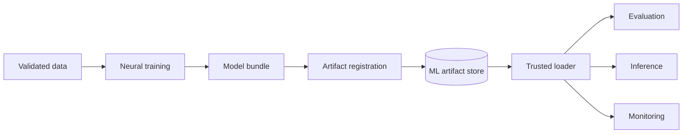

The frontend currently presents these capabilities through the broader Model Lab product surface rather than heavily exposing framework-specific labels such as RNN or LSTM.

---

## 15. ML artifact persistence

ML and deep-learning artifacts are not treated as ephemeral Python objects only.

The architecture contains explicit artifact-store logic supporting:

- model registration;
- persisted artifact identity;
- model loading;
- provenance relationships;
- later monitoring and evaluation.

The model artifact store location can be controlled through:

```text
DATALENS_ML_MODEL_ARTIFACT_STORE_PATH
```

This path is runtime configuration and should not be treated as a portable artifact identity by itself.

---

## 16. Model lifecycle governance

The `model_lifecycle` domain introduces a governance layer above runtime model files.

Current components include:

- artifact contracts;
- fingerprints;
- provenance contracts;
- registry;
- trusted artifact resolver;
- QLoRA artifact projection;
- QLoRA provenance projection;
- evaluation-decision contracts;
- evaluation-decision registry;
- Hospital evaluation projection.

### Lifecycle identity model

The governance layer separates four concepts:

```text
Artifact identity
    |
    v
Provenance identity
    |
    v
Evaluation evidence
    |
    v
Promotion decision
```

This prevents a model filename from becoming the only source of truth.

### Evaluation decision semantics

The current official QLoRA lifecycle decision uses:

```text
status: completed
promotion_decision: not_promoted
```

The word `completed` describes the evaluation lifecycle.

The word `not_promoted` describes the governance decision.

They are intentionally separate concepts.

---

## 17. LLM adaptation architecture

The adaptation subsystem is designed as an experimental model-development pipeline.

It includes:

- adaptation contracts;
- training preparation;
- quantized base-model loading;
- PEFT/QLoRA adapter handling;
- synthetic/preflight validation;
- frozen execution authorities;
- evaluation protocol;
- protected holdouts;
- scoring;
- official result artifacts;
- lifecycle projection.

### Base model and adapter

The adaptation experiment uses a frozen base model plus a separately stored adapter artifact.

This allows:

- reproducible model identity;
- independent adapter fingerprinting;
- lower-cost experimentation;
- explicit provenance.

### Protected evaluation boundary

The independent Hospital evaluation is intentionally single-use.

The evaluation architecture enforces separation between:

- model-visible prompt input;
- protected gold labels;
- scoring logic;
- final lifecycle decision.

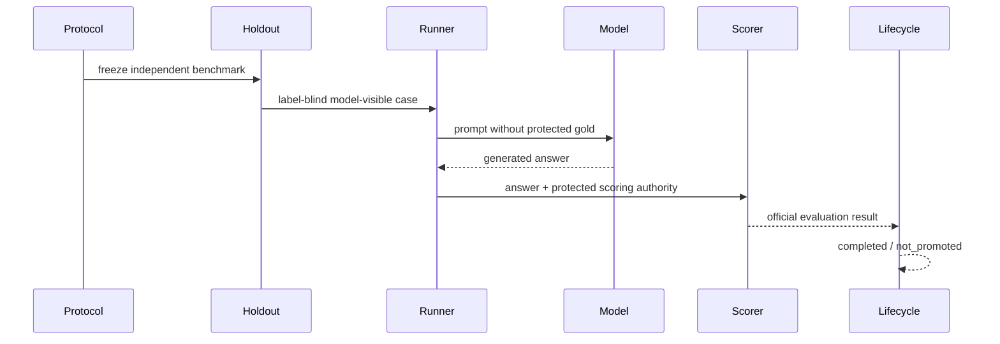

### Single-use rule

The Hospital benchmark was consumed exactly once.

```text
CONSUMED / NEVER REPLAY
```

Any future adapted candidate requiring independent validation must use new independent benchmark evidence.

---

## 18. Persistence architecture

DataLens uses multiple persistence forms according to the type of state.

### SQLite

SQLite is used where transactional or queryable local state is appropriate.

Examples include:

- preparation workflow/session persistence;
- application persistence;
- model lifecycle registries.

### Filesystem artifacts

Filesystem artifacts are used for:

- preparation artifacts;
- analysis/reporting artifacts;
- model artifacts;
- evaluation artifacts;
- adaptation artifacts;
- portable governance evidence.

### JSONL traces

Observability traces use append-oriented local JSONL storage.

### Docker volume

The standard Docker runtime persists backend runtime state through:

```text
datalens-api-var
```

This allows local state to survive a normal container shutdown.

---

## 19. Trust boundaries

The architecture uses several explicit trust boundaries.

### Browser boundary

The browser is a product client, not an authority for:

- preparation state;
- evaluation evidence;
- model provenance;
- lifecycle decisions;
- trusted model artifact paths.

### LLM boundary

The LLM is not trusted to directly determine:

- numerical analytical truth;
- model promotion;
- authoritative provenance;
- protected benchmark gold;
- workflow persistence state.

### Artifact boundary

Persisted model artifacts must pass trusted loading and identity checks before use.

### Evaluation boundary

Protected evaluation data is distinct from training and tuning data.

### Observability boundary

Trace usefulness does not justify storing arbitrary request payloads.

---

## 20. Error-handling architecture

Public API errors are translated from internal exceptions.

For example, Model Lab deliberately:

- hides cross-workflow artifact existence;
- sanitizes trusted artifact failures;
- distinguishes invalid prediction input from execution failure;
- avoids leaking internal model paths.

This pattern supports a general rule:

> Internal diagnostics and public error contracts serve different audiences and should not expose the same information.

---

## 21. Frontend architecture

The frontend is a Next.js App Router application.

Major product areas include:

- workspace;
- dataset import;
- preparation;
- analysis;
- reporting;
- Model Lab;
- monitoring and observability views.

The Model Lab frontend uses public HTTP/UI contracts rather than backend estimator objects.

### Frontend / backend relationship

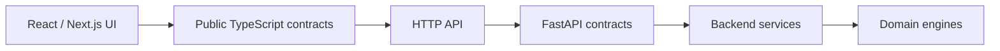

The goal is to prevent frontend state from becoming implicit backend authority.

---

## 22. Reporting architecture

Reporting sits downstream of deterministic analytical results.

The architecture separates:

- computed evidence;
- report-selection decisions;
- findings;
- visual payloads;
- generated explanation;
- final document rendering.

This allows report generation to benefit from AI explanation without allowing prose generation to redefine analytical evidence.

---

## 23. CI/CD architecture

DataLens currently uses four primary GitHub Actions workflows.

### `datalens-evals.yml`

Focused on evaluation and regression evidence.

### `datalens-runtime.yml`

Focused on runtime validation, including container/runtime integration.

### `datalens-publish.yml`

Focused on building and publishing application images.

### `datalens-release.yml`

Focused on controlled release behavior and release authority.

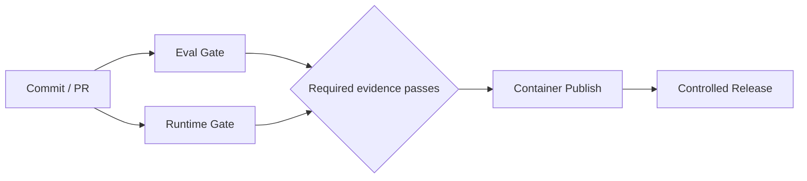

Application release and model promotion remain separate concepts.

A successful application CI pipeline does not automatically promote an ML or LLM candidate.

---

## 24. Container security architecture

Both main application containers use non-root runtime users.

### API image

The API image:

- uses `python:3.13-slim`;
- creates UID/GID `10001`;
- runs as user `datalens`;
- stores runtime state under `/app/var`;
- exposes a healthcheck;
- avoids running as root.

### Web image

The web image:

- uses multi-stage Node builds;
- runs production output only;
- creates UID/GID `10001`;
- runs as user `datalens`;
- exposes a healthcheck;
- disables Next.js telemetry.

These choices reduce runtime privilege and image surface compared with running development servers as root.

---

## 25. Configuration architecture

Runtime configuration is supplied through environment variables and container defaults.

Important configuration families include:

### LLM

```text
DATALENS_OLLAMA_HOST
DATALENS_LLM_DOCKER_BRIDGE_ENABLED
```

### ML / Deep Learning

```text
DATALENS_ML_MODEL_ARTIFACT_STORE_PATH
DATALENS_DL_PYTHON_PATH
```

### Model lifecycle

```text
DATALENS_MODEL_LIFECYCLE_REGISTRY_PATH
DATALENS_MODEL_LIFECYCLE_EVALUATION_DECISION_REGISTRY_PATH
```

### Observability

```text
DATALENS_AI_TRACE_ENABLED
DATALENS_RUNTIME_TRACE_ENABLED
DATALENS_AI_TRACE_PATH
DATALENS_RUNTIME_TRACE_PATH
```

### Frontend

```text
NEXT_PUBLIC_DATALENS_API_URL
```

A versioned environment reference is provided in `.env.example` so these configuration contracts are discoverable and reproducible without committing secrets.

---

## 26. Architectural principles

### 26.1 Deterministic computation is authoritative

Generated text does not replace statistical or analytical execution.

### 26.2 Server-owned state beats client assertions

Preparation readiness, evaluation evidence, workflow ownership, and model authority are reconstructed or validated server-side.

### 26.3 Contracts are preferred over implicit coupling

Data crosses subsystem boundaries through explicit request, result, provenance, artifact, and evaluation contracts.

### 26.4 Retrieval is not acceptance

RAG retrieval and relevance are separate steps.

### 26.5 Model files are not model governance

Lifecycle identity, provenance, evaluation, and promotion exist above raw model files.

### 26.6 Evaluation is immutable evidence

Protected holdouts are not silently converted into iterative tuning datasets.

### 26.7 Observability is privacy-constrained

Trace collection deliberately excludes high-risk raw payloads.

### 26.8 Local-first is a design property

The standard stack, LLM integration, persistence, and observability are designed to operate locally.

### 26.9 AI failures must degrade safely

Critical workflows use validation and fail-closed behavior where authority is ambiguous.

---

## 27. End-to-end analytical flow

A representative DataLens workflow is:

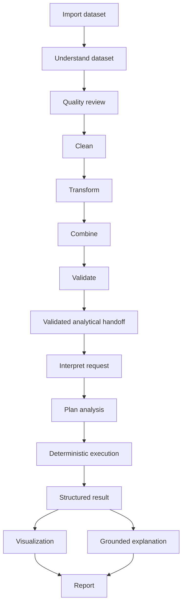

Optional stages can vary by workflow, but validation remains the handoff point into trusted downstream analysis.

---

## 28. End-to-end model flow

A representative ML or deep-learning workflow is:

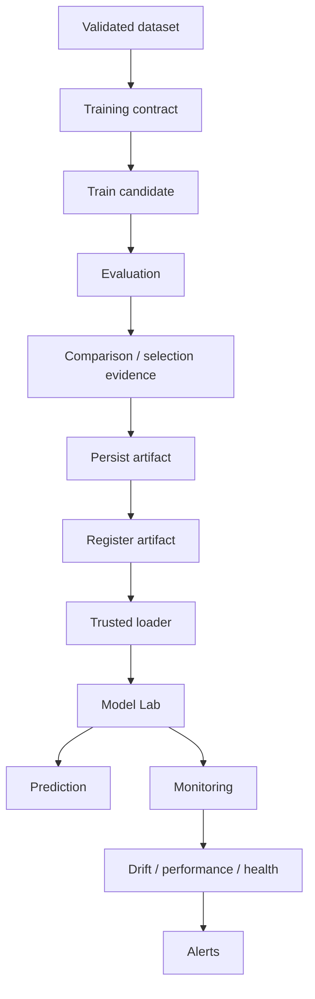

---

## 29. End-to-end adapted LLM flow

The adaptation lifecycle is intentionally stricter than ordinary experimentation.

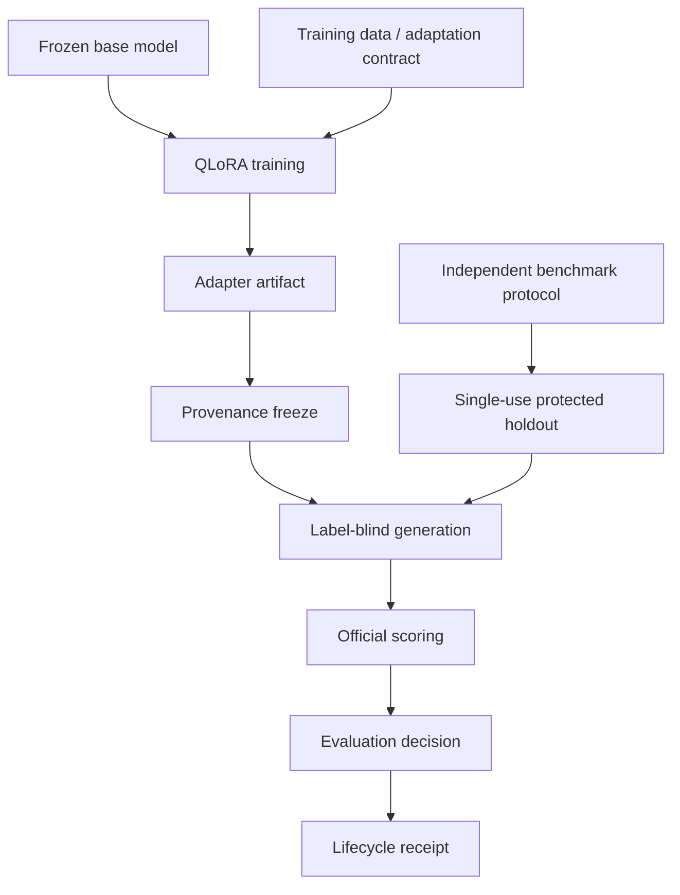

Current official decision:

```text
completed / not_promoted
```

---

## 30. What is intentionally not coupled

Several things are deliberately kept separate.

### Analysis vs explanation

Computed results can exist without an LLM explanation.

### Retrieval vs relevance

A retrieved chunk is not automatically approved as context.

### Training vs production serving

Creating a model does not automatically make it a trusted Model Lab artifact.

### Evaluation vs promotion

A completed evaluation does not imply promotion.

### CI success vs model promotion

Application CI and model lifecycle governance are independent authorities.

### Trace correlation vs raw request logging

Request observability does not require storing raw request contents.

---

## 31. Current architectural strengths

The current architecture demonstrates:

- clear domain separation;
- deterministic analytics;
- multi-stage preparation;
- local LLM integration;
- RAG decomposition;
- classical ML;
- deep learning;
- model persistence;
- monitoring;
- drift and health evaluation;
- model lifecycle governance;
- QLoRA adaptation;
- protected evaluation;
- observability;
- privacy-aware tracing;
- Dockerized runtime;
- CI/CD and release workflows;
- frontend integration.

---

## 32. Current architectural gaps

The main remaining gaps are documentation and explicit hardening rather than missing core architecture.

### Configuration documentation

The repository needs a versioned `.env.example` or equivalent configuration reference.

### Security documentation

Existing privacy and egress controls should be consolidated into a documented threat model.

Prompt-injection and jailbreak terminology is not currently a strong explicit part of the codebase and should be documented or hardened deliberately rather than assumed to exist.

### Product visibility for deep learning

Deep-learning workflows are implemented in the backend, but the frontend primarily presents them through the broader Model Lab abstraction.

A recruiter or engineer reading only the UI code would not immediately see the full RNN/LSTM/autoencoder capability set without architecture documentation.

### Capstone narrative

The repository needs a concise case study showing how the components combine into an AI Engineering system.

---

## 33. Architecture status

At the current consolidation point:

```text
Deterministic analytics        IMPLEMENTED
Preparation workflow           IMPLEMENTED
RAG                            IMPLEMENTED
Local LLM integration          IMPLEMENTED
Classical ML                   IMPLEMENTED
Deep Learning                  IMPLEMENTED
Model Lab                      IMPLEMENTED
Monitoring                     IMPLEMENTED
Observability                  IMPLEMENTED
Security boundaries            IMPLEMENTED / DOCUMENTATION HARDENING REMAINS
Model lifecycle governance     IMPLEMENTED
QLoRA adaptation               IMPLEMENTED
Independent evaluation         IMPLEMENTED
Docker                         IMPLEMENTED
CI/CD                          IMPLEMENTED
Architecture documentation     THIS DOCUMENT
Environment reference          IMPLEMENTED
Security threat model          IMPLEMENTED
Capstone case study            IMPLEMENTED
Demo walkthrough                IMPLEMENTED
Backend documentation           IMPLEMENTED
Final documentation audit       IN PROGRESS
```

The protected Hospital benchmark remains:

```text
CONSUMED / NEVER REPLAY
```

No protected evaluation is rerun as part of architecture documentation work.
